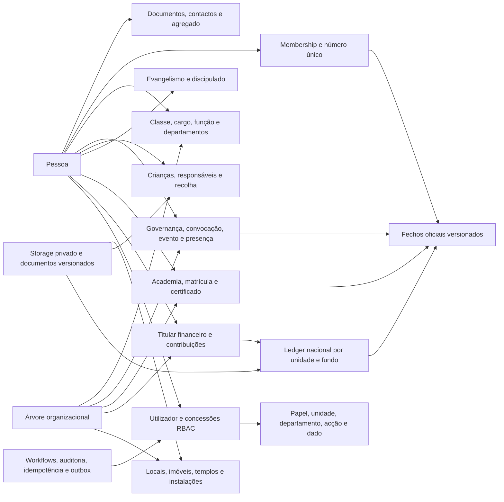

# ERD mestre

Estado: proposta para auditoria. 199 tabelas propostas; 439 relações FK, todas representadas no [Master completo](../diagrams/mepa_erd_master.mmd). A cardinalidade estrutural é distinta dos mínimos condicionados ao estado ACTIVE. O Master completo conserva todas as relações e os diagramas por domínio mostram também as dependências externas. Não se omitem relações para reduzir a imagem.

## Navegação por domínio

- [Identidade](../diagrams/mepa_erd_identidade.mmd): 21 tabelas.
- [Estrutura](../diagrams/mepa_erd_estrutura.mmd): 7 tabelas.
- [Storage e património](../diagrams/mepa_erd_storage_e_patrimonio.mmd): 15 tabelas.
- [Membros e credenciais](../diagrams/mepa_erd_membros_e_credenciais.mmd): 14 tabelas.
- [Ministério e departamentos](../diagrams/mepa_erd_ministerio_e_departamentos.mmd): 15 tabelas.
- [Governança e eventos](../diagrams/mepa_erd_governanca_e_eventos.mmd): 22 tabelas.
- [Crianças](../diagrams/mepa_erd_criancas.mmd): 7 tabelas.
- [Evangelismo](../diagrams/mepa_erd_evangelismo.mmd): 9 tabelas.
- [Academia](../diagrams/mepa_erd_academia.mmd): 26 tabelas.
- [Financeiro](../diagrams/mepa_erd_financeiro.mmd): 28 tabelas.
- [Comunicação](../diagrams/mepa_erd_comunicacao.mmd): 7 tabelas.
- [Estatística](../diagrams/mepa_erd_estatistica.mmd): 7 tabelas.
- [Segurança e workflows](../diagrams/mepa_erd_seguranca_e_workflows.mmd): 17 tabelas.
- [Importação](../diagrams/mepa_erd_importacao.mmd): 4 tabelas.

## Leitura de alto nível

Este mapa de navegação não substitui o Master relacional. As entidades indicadas na baseline como `attendance`, `checkins` e `campaigns` recebem prefixos de domínio para evitar confusão semântica. `course_modules` distingue módulos de conteúdo de sessões lectivas; `course_versions` congela conteúdos. `organizational_posts` e `department_posts` representam vagas sem Pessoas fictícias. `financial_parties` usa FKs tipadas e XOR em vez de subject_type/subject_id sem integridade. `legal_documents` centraliza identidade documental; `document_versions` preserva anexos. As nomenclaturas departamentais pedidas foram conservadas.
