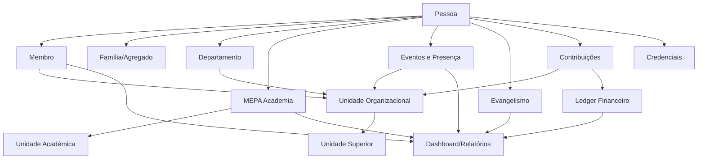

# MEPA CRM — Plano Geral, Arquitectura e Regras de Implementação

**Ficheiro canónico:** `mepa_crm.md`  
**Projecto:** MEPA Gestão — CRM/ChMS/ERP Eclesiástico Nacional  
**Instituição:** Missão Evangélica Pentecostal de Angola — MEPA  
**Estado:** Baseline aprovado para início da planificação e programação  
**Versão:** 1.1.0  
**Data-base:** 05-09-2026  
**Idioma funcional:** Português de Angola (`pt-AO`)  

---

## 0. REGRA DE OURO — LEITURA OBRIGATÓRIA ANTES DE PROGRAMAR

Este documento é a **fonte técnica e funcional de referência do projecto MEPA CRM**.

Todo agente de IA, programador, analista, arquitecto, designer, administrador de base de dados ou colaborador que realizar alterações no sistema **DEVE consultar este ficheiro antes de iniciar qualquer tarefa**.

Nenhuma funcionalidade relevante deve ser implementada apenas com base numa solicitação isolada, num ecrã antigo, numa tabela existente ou numa interpretação do código legado.

### Precedência de fontes

Quando existir conflito, a ordem de precedência será:

1. Estatuto, regulamentos e deliberações oficiais vigentes da MEPA;
2. decisões formalmente aprovadas e registadas em ADR;
3. este ficheiro `mepa_crm.md`;
4. modelo de dados e migrações aprovadas;
5. contratos de API;
6. implementação existente;
7. interface visual existente.

Se uma nova decisão alterar este documento, a alteração **deve primeiro ser registada**, o documento actualizado, os artefactos técnicos afectados revistos e só depois o código deve ser considerado concluído.

> **Regra:** código antigo não é automaticamente regra de negócio. O código deve obedecer ao domínio aprovado, e não o contrário.

---

# 1. PROTOCOLO OBRIGATÓRIO PARA AGENTES DE IA E PROGRAMAÇÃO

Antes de qualquer sessão de desenvolvimento, o agente deverá:

1. ler `mepa_crm.md`;
2. verificar as ADRs existentes;
3. consultar o grafo do projecto com **Graphify** antes de procurar ficheiros de forma aleatória;
4. verificar o estado das migrações, contratos de API e testes relacionados com a tarefa;
5. identificar o impacto transversal da alteração;
6. implementar;
7. executar testes e validações;
8. actualizar documentação, ADR e Graphify quando houver alteração estrutural;
9. aplicar **Humanizer** apenas ao conteúdo textual destinado a pessoas, quando apropriado;
10. nunca alterar regras canónicas, números, textos legais, nomes institucionais, rubricas contabilísticas ou contratos de API apenas para “melhorar a escrita”.

---

# 2. SKILLS OBRIGATÓRIAS E GOVERNANÇA DAS SKILLS

## 2.1 Graphify — obrigatória

O projecto deve usar Graphify como camada de conhecimento do repositório.

### Instalação recomendada

```bash
# Instalar o CLI
uv tool install graphifyy

# Instalar a skill no próprio projecto, de forma portável
graphify install --project --platform agents

# Em ambiente Codex, quando aplicável
graphify install --project --platform codex
```

Caso seja usado outro agente suportado, instalar o adaptador correspondente.

### Utilização

Na raiz do projecto:

```bash
graphify .
```

Antes de alterações de arquitectura ou refactorizações:

```bash
graphify query "<pergunta sobre o impacto da alteração>"
```

### Regra de actualização

Sempre que houver alteração relevante em entidades/relações, esquema SQL, migrações, módulos, rotas, contratos de API, configuração, permissões, workflows ou documentação arquitectural, o grafo deverá ser reconstruído/actualizado.

**Nenhuma refactorização transversal deve começar sem consulta prévia ao Graphify.**

## 2.2 Humanizer — obrigatória para textos destinados ao utilizador

Preferência inicial: skill portátil `blader/humanizer`.

### Instalação recomendada no projecto

```bash
npx skills add blader/humanizer
```

A instalação deve ser local ao projecto sempre que o ambiente permitir, para que a equipa trabalhe com a mesma versão.

### Quando aplicar

Aplicar Humanizer em mensagens de interface, emails, SMS, notificações, avisos, textos de ajuda, descrições institucionais, relatórios narrativos e textos do Portal/PWA.

### Quando NÃO aplicar automaticamente

Não usar Humanizer para modificar números de membro, códigos, chaves, SQL, JSON, nomes de campos, contratos de API, rubricas financeiras canónicas, referências legais, textos bíblicos oficiais, nomes de departamentos, citações ou textos já aprovados institucionalmente.

A ferramenta deve melhorar a naturalidade sem alterar o sentido institucional.

## 2.3 Skills internas do projecto

Além das skills externas, o repositório deverá possuir skills próprias, versionadas, simples e auditáveis:

```text
.agents/skills/
├── graphify/
├── humanizer/
├── mepa-domain/
├── mepa-security/
├── mepa-data/
└── mepa-ui/
```

### `mepa-domain`

Deve resumir invariantes do domínio: uma Pessoa é a identidade central; departamentos não criam bases paralelas; um membro mantém o Número Único; transferências não apagam histórico; a hierarquia é recursiva; finanças entre estruturas são relacionadas e não duplicadas; a Academia aceita membro e não membro.

### `mepa-security`

Deve garantir menor privilégio, escopo territorial/departamental, protecção de menores, protecção de informação financeira, auditoria e controlo de dados pessoais.

### `mepa-data`

Deve conhecer importações, deduplicação, numeração, staging, migrações, snapshots estatísticos e integridade contabilística.

### `mepa-ui`

Deve impor mobile-first, PWA, acessibilidade, consistência de componentes, `pt-AO`, formulários multi-etapas e tratamento claro de loading/vazio/erro/sucesso.

Se uma decisão aprovada alterar o domínio, as skills internas afectadas **devem ser actualizadas no mesmo PR/commit lógico**.

---

# 3. OBJECTIVO DO SISTEMA

Construir uma plataforma nacional integrada para a gestão da MEPA, reunindo num único ecossistema pessoas, famílias, membros, obreiros, estrutura eclesiástica, departamentos, evangelismo, cultos, eventos, presenças, Crianças e Adolescentes, Juventude, Mulheres, EBD, IBT, Formação de Quadros e RH, finanças, quotas, dízimos, ofertas, contribuições, orçamento, comunicação, relações públicas, estatística, documentos, credenciais, portal do membro, relatórios, BI, auditoria e segurança.

O sistema deverá substituir progressivamente folhas Excel, bases paralelas, formulários isolados e duplicação de informação.

---

# 4. PRINCÍPIOS NÃO NEGOCIÁVEIS

## 4.1 Pessoa antes de Membro

A entidade central será **Pessoa**. Uma pessoa pode existir sem ser membro: visitante, contacto evangelístico, aluno externo, responsável de menor, candidato, membro, obreiro ou dirigente.

A condição de membro é uma relação/estado eclesiástico da pessoa.

## 4.2 Um cadastro, múltiplas relações

Uma pessoa pode pertencer a uma congregação, integrar departamentos, ocupar cargos, frequentar cursos, participar em actividades, contribuir e fazer parte de agregado familiar sem duplicação de cadastro.

## 4.3 Histórico nunca deve ser destruído

Promoção, transferência, mudança de congregação, função ou departamento não eliminam o passado. Utilizar `data_inicio`, `data_fim`, `status`, `motivo` e documento de origem quando aplicável.

## 4.4 Única base nacional

Não haverá base independente por província. Será uma base nacional com escopo de acesso por unidade organizacional.

## 4.5 Configuração em vez de hardcode

Devem ser configuráveis: tipos de unidade, classes ministeriais, cargos, funções, departamentos, faixas etárias, regras de elegibilidade, validade/cores de passes, rubricas, workflows e critérios académicos.

---

# 5. ESTRUTURA INSTITUCIONAL DA MEPA

```text
Direcção Geral
└── Direcção Regional
    └── Direcção Provincial
        └── Direcção Municipal
            └── Centro Geral
                └── Centro Normal
                    └── Congregação
```

A hierarquia será modelada como árvore recursiva.

```text
organizational_units
- id
- parent_id
- unit_type_id
- code
- name
- province_id
- municipality_id
- address_id
- status
- opened_at
- closed_at
- metadata
```

Uma pessoa associada a uma Congregação deve ser contabilizável pelos níveis ascendentes autorizados. Não se cria novo cadastro em cada nível.

---


# 5.1 ÓRGÃOS DE DECISÃO, GOVERNANÇA E EVENTOS

A MEPA possui órgãos de decisão e fiscalização que não devem ser confundidos com níveis territoriais.

Órgãos de referência:

```text
CONGRESSO
ASSEMBLEIA_GERAL
CONSELHO_MINISTROS
CONSELHO_DIRECCAO
JUNTA_OFICIAL
COMISSAO_AUDITORIA_ETICA
```

Estes órgãos são permanentes enquanto estrutura institucional, mas as suas reuniões são tratadas como **Eventos**.

Modelo:

```text
Órgão de Decisão
        │
        ├── composição/membros do órgão
        │
        └── convoca
              ↓
            Evento
              ↓
        Lista de convocados
              ↓
        Convocação
              ↓
        Confirmação
              ↓
           Check-in
              ↓
        Credenciamento
              ↓
        Participação
```

O sistema deverá permitir que a equipa de coordenação crie a lista de convocados por critérios como:

- classe ministerial;
- cargo;
- pertença a órgão;
- região;
- província;
- município;
- departamento;
- selecção manual;
- convidados externos.

Entidades previstas:

```text
governance_body_types
governance_bodies
governance_body_memberships
governance_sessions
governance_resolutions

event_types
events
event_sessions
event_organizers
event_invitation_lists
event_invitees
event_invitations
event_checkins
event_credentials
event_attendance
event_locations
event_documents
```

A credencial permanente da MEPA deverá ser reutilizável no check-in. O QR Code do Passe identifica a pessoa/credencial, e o sistema deverá verificar:

```text
Pessoa válida
→ Credencial válida
→ Pessoa convocada
→ Estado da convocação
→ Check-in
→ Credenciamento do Evento
```

Convidados externos poderão ser cadastrados como Pessoa não membro e receber credencial temporária do evento, sem Número Único de Membro.


# 6. LOCAL FÍSICO NÃO É A MESMA COISA QUE UNIDADE ORGANIZACIONAL

Distinguir estrutura administrativa/eclesiástica de templo/local físico.

Entidades previstas:

```text
organizational_units
physical_locations
properties
temples
unit_location_links
```

Isto permite estatísticas separadas de unidades, congregações, centros, templos, propriedades e locais provisórios.

---

# 7. PESSOAS, FAMÍLIAS E MEMBROS

## 7.1 Entidades principais

```text
people
person_documents
person_contacts
addresses
households
household_members
person_relationships
person_files
memberships
ecclesiastical_milestones
```

## 7.2 Cadastro multi-etapas

Etapas de referência:

1. Identificação;
2. Documentação;
3. Contactos;
4. Residência;
5. Família/agregado;
6. Vida eclesiástica;
7. Estrutura MEPA;
8. Ministério/cargos;
9. Formação;
10. Profissão e situação laboral;
11. Informações complementares autorizadas;
12. Documentos;
13. Revisão e aprovação.

O fluxo deve esconder etapas não aplicáveis.

---

# 8. NÚMERO ÚNICO DE MEMBRO

## 8.1 Formato aprovado

O Número Único deixa de codificar cargo, província, município ou nível.

```text
MEPAAAMMSSSSSS
```

Onde:

```text
MEPA    = instituição
AA      = ano de emissão/admissão aprovada
MM      = mês
SSSSSS  = contador nacional contínuo, com seis dígitos
```

Exemplos:

```text
MEPA2609000001
MEPA2609000002
MEPA2610000003
```

### Sequência

A sequência deverá ser controlada por um **contador nacional contínuo**, antecedido por **ano + mês**. A mudança de mês ou de ano **não reinicia o contador**; o primeiro número emitido no novo período deverá continuar imediatamente após o último número utilizado no período anterior. Exemplo: se o último número de Setembro for `MEPA2609000001`, o primeiro número de Outubro será `MEPA2610000002`. A combinação completa é única. A geração deve ocorrer dentro de transacção com controlo de concorrência.

## 8.2 Imutabilidade

O número não muda por transferência, promoção, mudança de congregação, município, província, classe, função ou departamento.

## 8.3 Identificador técnico

Separadamente:

```text
person_id = UUID ou ULID
```

## 8.4 Legado

Preservar:

```text
member_number
legacy_member_number
```

Pesquisar por ambos. Nunca sobrescrever o número antigo.

## 8.5 Migração de membros antigos

Quando a data histórica for insuficiente, preservar o número legado, marcar origem `legacy_import`, aplicar regra de migração aprovada e nunca inventar datas.

## 8.6 Não membro

Pessoa não membro não recebe Número Único de Membro.

---

# 9. CARGOS, CLASSES, FUNÇÕES E HISTÓRICO MINISTERIAL

Separar classe/categoria ministerial, cargo, função, departamento e unidade onde a função é exercida.

```text
ministerial_assignments
- id
- person_id
- class_id
- position_id
- function_id
- department_instance_id
- organizational_unit_id
- starts_at
- ends_at
- status
- appointment_document_id
```

O histórico anterior nunca é apagado.

---

# 10. DEPARTAMENTOS

Nenhum departamento terá tabela própria de pessoas.

```text
departments
department_instances
department_memberships
department_roles
department_activities
```

`departments` representa o tipo; `department_instances` representa a existência em determinado nível.

---


## 10.1 Instâncias locais de departamentos e nomeações

A mesma definição institucional de departamento pode existir em diferentes unidades:

```text
Departamento de Estatísticas — Direcção Geral
Departamento de Estatísticas — Direcção Provincial do Huambo
Departamento de Estatísticas — Direcção Municipal da Caála
Departamento de Estatísticas — Centro X
Departamento de Estatísticas — Congregação Y
```

As Congregações funcionam, neste aspecto, como uma mini-estrutura da Direcção Geral, com representação dos departamentos aplicáveis.

Entidades:

```text
department_categories
departments
department_instances
department_posts
department_appointments
```

Deve ser possível distinguir:

```text
Departamento não constituído
Departamento constituído
Cargo preenchido
Cargo vago
Cargo interino
```

A ausência de responsável **não deve aparecer como vazio**. Deve ser apresentada claramente como:

```text
SEM NOMEAÇÃO
```

Isto permitirá consultas como:

- Quem é o Director de Estatísticas da Congregação A?
- Quem é o Director de Estatísticas da Direcção Municipal da Caála?
- Quem é o Director Provincial de Estatísticas do Huambo?
- Quais unidades ainda não têm responsável nomeado para determinado departamento?


# 11. CRIANÇAS E ADOLESCENTES

Prever responsável, contactos de emergência, autorização de recolha/saída, consentimentos, classes, presenças, check-in/check-out, actividades, apoio autorizado, EBD e transição por faixa etária.

Mudança de faixa deve gerar recomendação, não alteração silenciosa. Dados de menores terão permissões reforçadas.

---

# 12. JUVENTUDE E MULHERES

O sistema poderá sugerir elegibilidade por idade, critérios institucionais, congregação e estado de membro. A adesão efectiva deve ser registada e auditável. Faixas e regras não ficam hardcoded.

---

# 13. EVANGELISMO E DISCIPULADO

```text
Contacto
→ Visitante
→ Acompanhamento
→ Interessado
→ Decisão/Conversão
→ Discipulado
→ Baptismo
→ Integração
→ Membro
```

Entidades:

```text
outreach_campaigns
outreach_contacts
followups
discipleship_tracks
discipleship_steps
decisions
integration_events
```

Indicadores: pessoas alcançadas, acompanhamentos, decisões, discipulados, baptismos, integrações e permanência posterior.

---

# 14. MEPA ACADEMIA

MEPA Academia será a plataforma comum de EBD, IBT, Formação de Quadros/RH e outros programas aprovados.

## 14.1 Alunos não membros

**Aceita alunos que não sejam membros.** A pessoa entra em `people`, recebe perfil académico e não recebe número de membro. Se futuramente for admitida como membro, reutiliza o mesmo `person_id`.

## 14.2 Estrutura académica

```text
academic_units
programs
courses
curricula
course_modules
lessons
lesson_resources
cohorts
classes
instructors
enrollments
attendance
assessments
assessment_attempts
grades
progress
certificates
transcripts
```

Cursos podem ser públicos, apenas membros, apenas obreiros, por classe, convite ou pré-requisito.

## 14.3 Vídeos

Não hospedar vídeo pesado no hosting. Usar YouTube/Vimeo através de provider/adapter e guardar metadados/IDs.

## 14.4 Progresso

Conclusão pode combinar percentagem de vídeo, material obrigatório, presença, quiz, prova, trabalho, nota mínima e aprovação administrativa.

## 14.5 Certificados

Conclusão aprovada gera certificado, histórico no perfil e código/QR de validação quando aprovado.

---

# 15. FINANÇAS — PRINCÍPIO GERAL

Construir sobre ledger contabilístico consistente, ainda que a UI seja simples.

Separar conta financeira, fundo, rubrica/categoria, centro de responsabilidade, unidade, pessoa/doador, obrigação, movimento, transferência e orçamento.

A camada contabilística deve suportar partidas dobradas.

---

# 16. CATÁLOGO FINANCEIRO INICIAL

## 16.1 Receitas/entradas operacionais

Dízimos; Dízimos Selectivos; Ofertas; Ofertas Alçadas; Ofertas Especiais; Quotas Orçamentais; Quotas de Departamento; Contribuições; Contribuições Selectivas; Doações; Retorno sobre Investimentos; Outras Entradas.

## 16.2 Custos com produtos e serviços

Fornecedores; Transportes; Mão-de-obra terceirizada.

## 16.3 Despesas administrativas

Telemóveis; Correios; Táxi/Mototáxi; Internet; TV Satélite/Cabo; Energia Eléctrica; Combustíveis; Almoço/Café/Lanches; Água; Limpeza; Formação; Outras Despesas Administrativas.

## 16.4 Despesas financeiras

Tarifas Bancárias; Outras Despesas Financeiras.

## 16.5 Despesas com pessoal

Salário; 13.º Salário; Subsídio de Férias; Assistência Social; INSS; Plano de Saúde; Vale Transporte/Refeição; Outras Despesas com Pessoal.

> **Pendência P0-FIN:** “Arrendamento” aparece no modelo legado junto a Despesas com Pessoal. Validar classificação antes do seed definitivo.

## 16.6 Materiais e equipamentos

Materiais; Equipamentos; Outras despesas com Materiais e Equipamentos.

## 16.7 Investimento em comunicação/marketing

Panfletos; Cartazes/Folhetos; Site/Blogs/Redes Sociais; Rádio/TV; Eventos; Outros.

## 16.8 Investimento em bens materiais

Equipamentos Informáticos; Reformas de Infraestruturas; Mobiliário; Equipamentos Eléctricos; Uniformes; Utensílios; Outros.

## 16.9 Investimento em desenvolvimento

Consultoria; Treinamento; Negócios; Refrescamento; Outros investimentos de desenvolvimento.

## 16.10 Não operacionais

Entradas: venda de equipamentos usados e outras autorizadas. Saídas: pagamento de empréstimos, dívidas passadas, juros de mora e outras saídas não operacionais.

O principal de empréstimos não deverá ser confundido com despesa operacional.

---

# 17. RELATÓRIOS FINANCEIROS

A mesma base deve gerar relatórios separados:

- Resultado: receitas, custos, despesas, resultado operacional, investimentos, não operacionais, excedente/défice;
- Execução Orçamental: orçado, realizado, saldo, desvio e percentagem;
- Fluxo de Caixa: entradas, saídas, saldo inicial/final por conta/período;
- Tesouraria: caixas, bancos, contas, disponibilidade;
- Obrigações: contas a receber/pagar, pendentes, quotas previstas/recebidas/vencidas;
- Transferências internas: enviado → aguardando confirmação → recebido → conciliado.

Transferência entre estruturas **não deve duplicar receita**.

---

# 18. QUOTAS, CONTRIBUIÇÕES E OBRIGAÇÕES

```text
financial_obligations
- subject_type
- subject_id
- rule_id
- period
- amount_due
- amount_paid
- due_at
- status
```

Estados: Previsto, Pendente, Parcial, Pago, Vencido, Dispensado, Cancelado.

Aplicável a pessoa, classe, departamento, congregação, centro, município, província ou região.

---

# 19. DÍZIMOS, OFERTAS E PRIVACIDADE

Ofertas podem ser identificadas, anónimas/agregadas, familiares, institucionais ou em espécie.

Dízimos e quotas individuais terão acesso estritamente limitado. Directores sem competência financeira não visualizam contribuições individuais.

---

# 20. ORÇAMENTO

```text
Rascunho
→ Submetido
→ Revisto
→ Aprovado
→ Em Execução
→ Encerrado
```

Relatórios: solicitado, aprovado, executado, disponível, desvio e projecção.

---

# 21. ESTATÍSTICA E BUSINESS INTELLIGENCE

O Departamento de Estatística não recadastra dados. A estatística deriva da base central.

## 21.1 Indicadores mínimos

Total de pessoas/membros; activos/inactivos; sexo; faixas etárias; bebés/crianças/adolescentes/jovens/adultos/idosos; distribuição por departamento e território; idade; habilitações teológicas/literárias; situação laboral; estado civil; classes ministeriais; congregações; centros; templos e outros locais.

## 21.2 Indicadores adicionais

Novos membros; transferências; baptismos; conversões; crescimento líquido; presença média; alunos activos; conclusão; contribuições; quotas; actividades e qualidade dos dados.

## 21.3 Drill-down

```text
Nacional
→ Região
→ Província
→ Município
→ Centro Geral
→ Centro Normal
→ Congregação
```

## 21.4 Fechos oficiais

Distinguir tempo real de snapshot/fecho oficial. Fecho aprovado não muda silenciosamente.

---

# 22. DASHBOARDS POR PERFIL

Executivo Nacional; Estatístico; Financeiro; Evangelismo; Academia; Departamento; Estrutura Territorial; Credenciais; Qualidade de Dados; Portal do Membro.

Cada utilizador vê apenas o que o papel e escopo autorizam.

---

# 23. QUALIDADE DOS DADOS

Indicadores: sem foto; telefone inválido; documento duplicado; possível duplicado; sem congregação; nascimento em falta; cadastro pendente; unidade sem responsável; curso sem professor; movimento financeiro sem conciliação.

Telefones são texto normalizado, nunca números decimais.

---

# 24. CREDENCIAIS E PASSES

## 24.1 Princípio

O sistema recebe templates e produz JPG, PNG, PDF, geração individual, lote, ZIP e PDF de produção para gráfica.

## 24.2 Frente

Logótipo; Direcção Geral; foto; nome; classe; Número Único; telefone quando aprovado; função; código de barras; site. Campos configuráveis.

## 24.3 Verso

Predominantemente institucional: observação, base legal, texto bíblico, QR, emissão, expiração, assinatura, identificação institucional e site.

## 24.4 Cores por classe

A faixa próxima da fotografia será configurável:

```text
credential_classes
- id
- name
- color
- text_color
- is_active
```

Pastor: azul institucional. Sugestões pendentes de aprovação visual: Ancião bordô; Evangelista verde; Diácono/Diaconisa âmbar; Membro grafite/variante institucional.

As cores não ficam hardcoded.

## 24.5 Membro por aprovação

Passe de membro só é emitido após aprovação formal.

## 24.6 Versões

```text
credential
- person_id
- credential_type_id
- member_number
- version
- issued_at
- expires_at
- status
- template_version
```

Reemissão mantém o número e incrementa a versão.

## 24.7 QR

QR usa URL/token opaco. A página pública mostra apenas o necessário para validar a credencial. Não expor BI, endereço, finanças, família ou dados confidenciais.

## 24.8 Código de barras

Pode ser mantido na frente. Preferência: Code 128 do Número Único.

## 24.9 Impressão

Template configurável. Referência CR80: 85,60 × 53,98 mm, 300 DPI, aproximadamente 1011 × 638 px.

---

# 25. ARMAZENAMENTO DE FOTOS E DOCUMENTOS

Planeamento inicial para ~70.000 membros, além de alunos externos e outros perfis.

No upload: validação → orientação → crop → redimensionamento → compressão → WebP/JPEG optimizado.

Meta: 100–300 KB por foto.

```text
70.000 × 100 KB ≈ 7 GB
70.000 × 200 KB ≈ 14 GB
70.000 × 300 KB ≈ 21 GB
```

Com thumbnails/documentos/margem:

- 50 GB: mínimo prático;
- 100 GB: preferível quando o hosting permitir.

Não guardar imagens Base64/BLOB pesadas no BD. Guardar path, disco, MIME, size e hash.

Verificar também limite de inodes, upload, processos e BD no shared hosting.

A camada de ficheiros deve aceitar local/private storage e posteriormente S3-compatible Object Storage sem reescrever o domínio.

Economia: compressão, redimensionamento, remoção de EXIF, evitar thumbnails redundantes, hash de duplicados, vídeos fora do CRM, backup separado de media/BD.

---


# 25.1 GEOLOCALIZAÇÃO, TEMPLOS, PROPRIEDADES E ANEXOS

As unidades eclesiásticas, em especial Congregações e Centros, podem estar associadas a locais físicos georreferenciados.

Entidades previstas:

```text
physical_locations
properties
property_documents
facility_types
facilities
organizational_unit_locations
```

Cada local físico poderá guardar:

```text
latitude
longitude
address
location_type
status
```

Isto deverá permitir funcionalidades como:

- localizar o templo mais próximo;
- visualizar templos num mapa;
- obter direcções;
- filtrar unidades por distância;
- conhecer a localização exacta de Congregações e Centros.

### Unidade não é igual a imóvel

Uma Congregação é uma unidade organizacional. O templo é um local/imóvel.

Uma Congregação pode:

- funcionar em templo próprio;
- funcionar em imóvel arrendado;
- funcionar temporariamente noutro espaço;
- possuir mais de uma instalação;
- mudar de local sem perder identidade institucional.

### Documentos de legalização e propriedade

O CRM deverá permitir anexar documentos como:

- título de propriedade;
- declaração;
- contrato de arrendamento;
- direito de superfície;
- licença;
- autorização;
- croquis;
- certidão;
- outros.

### Anexos e infraestruturas

Não usar colunas rígidas como `tem_escola` ou `tem_biblioteca`.

Utilizar:

```text
facility_types
facilities
```

Exemplos:

```text
Escola
Biblioteca
Gabinete
Centro de Formação
Clínica
Residência
Salão
Outro
```


# 26. EVENTOS, CULTOS E PRESENÇAS

Tipos: culto, reunião, conferência, campanha, actividade, formação, assembleia, evento juvenil, actividade infantil.

```text
events
event_sessions
registrations
attendance
checkins
```

Métodos: contagem total, check-in nominal, QR.

---

# 27. COMUNICAÇÃO E RELAÇÕES PÚBLICAS

Usar a mesma base de pessoas para segmentação por email, SMS, WhatsApp, push e notificação interna.

Preparar integração com website institucional. Evitar listas paralelas sem necessidade.

---

# 28. PORTAL/PWA DO MEMBRO

```text
Início
Meu Passe
Meu Perfil
Minha Congregação
Minhas Contribuições
Meus Cursos
Meus Certificados
Eventos
Notificações
Pedidos
```

Alterações sensíveis dependem de aprovação.

---

# 29. PWA E OFFLINE-FIRST SELECTIVO

Sistema Web, mobile-first, PWA e responsivo.

Offline seleccionado: rascunho, presença, checklists, visitas, actividades e certas operações académicas.

Online obrigatório: aprovação de membro, Número Único, segurança, reconciliação, emissão definitiva e alterações estruturais.

Usar fila de sincronização e detecção de conflito. Nunca descarregar o banco nacional inteiro para o dispositivo.

---

# 30. PERMISSÕES E ESCOPO

```text
Papel
+
Unidade Organizacional
+
Departamento
+
Tipo de Dado
+
Acção
```

Autorização deve ser aplicada no backend. Esconder botões não é segurança.

---

# 31. SEGURANÇA

Obrigatório: autenticação segura; 2FA em perfis críticos; hashing forte; rate limiting; CSRF; validação; ORM/prepared statements; protecção XSS; cabeçalhos seguros; sessão segura; menor privilégio; segregação financeira; auditoria; backups; restauração testada.

Classificação de dados: Público institucional, Interno, Restrito, Confidencial, Altamente sensível.

---

# 32. AUDITORIA

Registar utilizador, data/hora, IP/sessão, entidade, acção, valor anterior/novo, motivo e origem para operações relevantes.

Logs críticos não devem ser elimináveis pela interface comum.

---

# 33. WORKFLOWS

### Novo membro

```text
Rascunho → Submetido → Validação → Aprovação → Número Único → Credencial
```

### Transferência

```text
Pedido → Validação de Origem → Aceitação do Destino → Efectivação
```

### Nomeação

```text
Proposta → Parecer → Aprovação → Publicação → Histórico
```

### Formação

```text
Inscrição → Frequência → Avaliação → Resultado → Certificação
```

### Despesa

```text
Solicitação → Parecer → Autorização → Pagamento → Prestação de Contas
```

---

# 34. FORM BUILDER

Criar formulários configuráveis para inscrições, levantamentos, eventos, campanhas, pedidos e inquéritos.

Campos estruturais da Pessoa não devem ser recriados como custom fields.

---

# 35. MODELO CONCEPTUAL



---

# 36. GRUPOS DE TABELAS

```text
IDENTIDADE
├── people
├── person_documents
├── person_contacts
├── addresses
├── households
├── household_members
├── person_relationships
└── person_files

MEMBROS
├── memberships
├── member_numbers
├── ecclesiastical_milestones
├── transfers
└── credentials

ESTRUTURA
├── organizational_unit_types
├── organizational_units
├── physical_locations
├── temples
└── unit_location_links

MINISTÉRIO
├── ministerial_classes
├── positions
├── functions
└── ministerial_assignments

DEPARTAMENTOS
├── departments
├── department_instances
├── department_memberships
└── department_roles

EVENTOS
├── events
├── event_sessions
├── registrations
├── attendance
└── checkins

EVANGELISMO
├── outreach_campaigns
├── outreach_contacts
├── followups
├── decisions
└── discipleship

ACADEMIA
├── academic_units
├── programs
├── courses
├── curricula
├── course_modules
├── lessons
├── resources
├── cohorts
├── enrollments
├── assessments
├── grades
├── progress
└── certificates

FINANCEIRO
├── accounts
├── funds
├── chart_of_accounts
├── financial_categories
├── obligations
├── contributions
├── budgets
├── journal_entries
├── journal_lines
├── internal_transfers
├── receivables
├── payables
└── reconciliations

COMUNICAÇÃO
├── communication_templates
├── audiences
├── campaigns
├── messages
└── delivery_logs

SISTEMA
├── users
├── roles
├── permissions
├── role_permissions
├── scopes
├── workflows
├── workflow_instances
├── workflow_tasks
├── notifications
├── audit_logs
└── system_settings
```

O ERD físico será produzido em P0.

---

# 37. ARQUITECTURA TECNOLÓGICA

Frontend: React + TypeScript + Vite + PWA.  
Backend: Laravel/PHP + REST API versionada.  
BD inicial: MySQL 8.x ou MariaDB compatível com o hosting.

A escolha exacta MySQL/MariaDB depende do provedor contratado.

Laravel é recomendado por compatibilidade com shared hosting, migrations, ORM, filas, scheduler, validação, policies, storage abstraction e trajectória simples para VPS.

---

# 38. INFRAESTRUTURA — SHARED HOSTING → VPS

## 38.1 Inicial

Funcionar sem dependência obrigatória de Docker, Redis, Supervisor, WebSocket permanente ou processos residentes.

Usar PHP/Laravel, MySQL/MariaDB, frontend compilado, Cron, database queue quando necessário, filesystem abstraction e serviços externos por adapter.

## 38.2 Requisitos mínimos do hosting

Verificar PHP/extensões; Composer/SSH ou deploy viável; Cron; SSL; MySQL/MariaDB; espaço >=50 GB (preferível 100 GB se media local); inodes; tamanho de BD; memória PHP; CPU/processos; backups; subdomínios; DNS; SMTP e possibilidade de storage S3 externo.

## 38.3 Preparação para VPS

Desde o primeiro dia: `.env`, sem caminhos absolutos, storage adapters, API stateless quando possível, migrations reproduzíveis, backups portáveis, separação de frontend/backend/media.

## 38.4 Migração

Migrar quando o shared hosting limitar concorrência, jobs, desempenho, segurança operacional, banco, ficheiros, observabilidade ou quando Redis/workers/WebSockets forem necessários.

Na VPS: Nginx/Apache, PHP-FPM, Redis, workers, Supervisor/systemd, Object Storage/CDN, monitoring, logs centralizados e backups automatizados.

A migração não deve exigir reescrever o domínio.

---

# 39. API

Prefixo de referência:

```text
/api/v1/...
```

JSON consistente, paginação, filtros, erros de validação padronizados, idempotência onde necessário, autorização no backend e audit trail de writes críticos.

---

# 40. STORAGE

Criar serviço central para photo, identity_document, certificate, appointment_document, financial_attachment, event_media, course_material e credential_render.

Cada ficheiro deve possuir dono lógico, escopo, classificação, checksum, tamanho, MIME, storage disk, path e created_by.

---

# 41. IMPORTAÇÃO E MIGRAÇÃO

```text
Upload
→ Staging
→ Normalização
→ Deduplicação
→ Mapeamento
→ Validação
→ Pré-visualização
→ Aprovação
→ Importação
→ Relatório
```

Detectar número legado repetido, documento repetido, telefone, nome+nascimento semelhante, congregação/cargo desconhecido e relacionamentos inválidos.

---

# 42. GERADOR LEGADO

O formato antigo utilizava:

```text
Cargo + Província + Município + Sequência(4) + Nível(2) + Ano(2)
```

A nova implementação preserva como `legacy_member_number`, nunca regenera silenciosamente e gera novo número apenas pela regra aprovada.

---

# 43. DESIGN SYSTEM E MOBILE-FIRST

Toda tela nasce para smartphone: campos legíveis, navegação simples, tabelas adaptativas, filtros persistentes, formulários por etapas, autosave de rascunho, feedback de sincronização, acessibilidade e tratamento de erro/loading/vazio/sucesso.

Desktop aproveita mais espaço sem criar aplicação separada.

---

# 44. LOCALIZAÇÃO

```text
Idioma: pt-AO
Moeda: AOA / Kz
Datas: DD/MM/AAAA
Telefone: suporte +244
```

Humanizer deve respeitar terminologia MEPA e português institucional angolano.

---

# 45. RELATÓRIOS

Quando aplicável: período, unidade, departamento, status, filtros, totais, data/hora, utilizador, PDF e Excel/CSV autorizado.

Relatórios oficiais devem poder ser fechados/versionados.

---

# 46. NOTIFICAÇÕES

Eventos possíveis: membro aprovado, transferência, quota vencida, aula nova, avaliação, evento, passe expirando, orçamento pendente, despesa aguardando aprovação, dado incompleto, certificado emitido.

Preferir motor de eventos + canais.

---

# 47. BACKUPS E RECUPERAÇÃO

Backup automático de BD e media, retenção, cópia externa e testes periódicos de restauração.

Um backup só é confiável depois de restaurado com sucesso em teste.

---

# 48. TESTES OBRIGATÓRIOS

Unitários: número, cálculos, permissões, elegibilidade, progresso académico.  
Integração: cadastro, aprovação, transferência, lançamentos, transferências financeiras, matrícula e passe.  
E2E: fluxos críticos Web/PWA.  
Segurança: autorização horizontal/vertical, CSRF, XSS, upload, brute force, exposição e escopo territorial.  
Migração: base limpa e actualizações de versão.

---

# 49. DEFINITION OF DONE

Uma tarefa só está concluída quando está alinhada com `mepa_crm.md`, impacto verificado no Graphify, migrations ajustadas, backend autorizado, UI trata estados, testes passam, auditoria considerada, textos revistos, documentação actualizada e Graphify actualizado se a estrutura mudou.

---

# 50. ADR

Criar `/docs/adr/`.

Exemplos:

```text
0001-use-person-as-root-entity.md
0002-organizational-tree.md
0003-member-number-v2.md
0004-shared-hosting-first.md
0005-financial-ledger.md
```

Cada ADR contém contexto, decisão, alternativas, consequências, data e estado.

---

# 51. ESTRUTURA DE REPOSITÓRIO SUGERIDA

```text
mepa-crm/
├── apps/
│   ├── web/
│   └── api/
├── docs/
│   ├── adr/
│   ├── diagrams/
│   ├── api/
│   └── migrations/
├── database/
│   ├── seeds/
│   └── reference-data/
├── .agents/
│   └── skills/
├── scripts/
├── tests/
├── mepa_crm.md
├── CHANGELOG.md
└── README.md
```

---

# 52. MÓDULOS OFICIAIS

1. Dashboard e BI;
2. Pessoas, Famílias e Membros;
3. Estrutura Administrativa MEPA;
4. Obreiros, Cargos e Liderança;
5. Departamentos;
6. Evangelismo e Discipulado;
7. Cultos, Eventos e Presenças;
8. Crianças e Check-in;
9. MEPA Academia;
10. Finanças, Contribuições e Quotas;
11. Orçamento e Prestação de Contas;
12. Comunicação e Relações Públicas;
13. Estatística e Relatórios;
14. Documentos, Certificados e Passes;
15. Portal/PWA do Membro;
16. Administração, Segurança e Auditoria.

---

# 53. ROADMAP

## P0 — Planificação e Fundação Técnica

ERD, dicionário de dados, ADRs, permissões, fluxos, design system, API contracts, repo, Graphify, skills, CI, ambientes e baseline de testes.

## P1 — Identidade e Estrutura

Autenticação, roles/scopes, árvore, pessoas, famílias, contactos, documentos e importação.

## P2 — Membros e Credenciais

Membership, aprovação, Número Único, cargos, histórico, transferências, passes, QR e lote.

## P3 — Departamentos, Eventos e Evangelismo

Departamentos, actividades, presença, check-in, Crianças, Juventude, Mulheres, Evangelismo e discipulado.

## P4 — Finanças

Plano de contas, fundos, rubricas, ledger, quotas, contribuições, dízimos, ofertas, caixas, bancos, transferências, orçamento e relatórios.

## P5 — MEPA Academia

Programas, cursos, turmas, professores, alunos internos/externos, vídeos, avaliações, progresso e certificados.

## P6 — Comunicação

Templates, segmentação, notificações, email, SMS, WhatsApp e integrações.

## P7 — Estatística e BI

Dashboards, drill-down, snapshots, indicadores, relatórios oficiais e qualidade de dados.

## P8 — Portal/PWA

Cartão digital, perfil, cursos, contribuições, certificados, notificações e offline selectivo.

## P9 — Consolidação e VPS

Redis, workers, monitoring, object storage/CDN, optimização, observabilidade e escalabilidade quando necessário.

---

# 54. PILOTO E ROLLOUT

Antes de implantação nacional: ambiente de testes → estrutura piloto → migração controlada → validação de números/finanças/permissões → formação → recolha de problemas → correcções → expansão gradual.

Evitar implantação nacional “big bang”.

---

# 55. PONTOS A VALIDAR NA P0

- classificação de algumas rubricas legadas;
- paleta final das classes no Passe;
- validade por tipo de credencial;
- política exacta de novos números para membros legados;
- lista oficial actualizada de departamentos/códigos;
- faixas etárias oficiais;
- progressão entre departamentos;
- campos públicos exactos do QR;
- fornecedor de SMS/WhatsApp;
- gateway de pagamento futuro;
- hosting escolhido e limites técnicos.

---

# 56. DECISÕES JÁ FECHADAS

- Pessoa é a entidade central;
- Academia aceita alunos não membros;
- não membro não recebe Número Único;
- número novo não codifica cargo/localização;
- formato `MEPAAAMMSSSSSS`;
- número permanece após promoção/transferência;
- legado é preservado;
- Congregação é a origem operacional do fiel;
- estrutura nacional é árvore;
- departamentos partilham a mesma Pessoa;
- estatística deriva da base central;
- finanças usam ledger consistente;
- transferências internas não duplicam receita;
- vídeos não ficam no hosting;
- PWA é mobile-first;
- offline é selectivo;
- primeira produção usa shared hosting;
- arquitectura nasce pronta para VPS;
- fotos são comprimidas e não ficam em BLOB/Base64;
- Passe pode gerar JPG/PNG/PDF;
- frente é personalizada ao portador;
- verso é predominantemente institucional;
- cor da classe é configurável;
- QR não expõe dados sensíveis;
- Humanizer e Graphify fazem parte do protocolo de desenvolvimento.

---


## 56.1 Decisões adicionais fechadas na v1.1.0

- “Centro” significa Centro Normal;
- apenas “Centro Geral” deve ser escrito por extenso;
- cada Município pode ter zero ou um Centro Geral;
- cada Município deve possuir um ou mais Centros;
- todo Centro coordena Congregações;
- os órgãos de decisão são estruturas permanentes de governança;
- as reuniões desses órgãos são tratadas como Eventos;
- o Passe MEPA pode ser reutilizado como credencial de check-in por QR Code;
- convidados externos podem participar de eventos sem serem membros;
- departamentos existem como definição institucional e como instâncias locais;
- cargos vagos devem aparecer explicitamente como “SEM NOMEAÇÃO”;
- Congregações podem possuir representação dos departamentos aplicáveis;
- unidade organizacional e templo/imóvel são entidades distintas;
- Congregações e Centros podem possuir latitude/longitude;
- propriedades podem possuir documentação de legalização;
- anexos físicos como Escola ou Biblioteca são modelados por tipos de instalações;
- pais ou responsáveis de membros podem existir como Pessoas sem serem membros.


# 57. REGRA PARA ALTERAÇÕES FUTURAS

```text
Nova decisão
→ validar com regra institucional
→ criar/actualizar ADR
→ actualizar mepa_crm.md
→ actualizar skill interna afectada
→ actualizar ERD/contrato/migration
→ reconstruir Graphify
→ implementar
→ testar
→ documentar
```

Alterar código primeiro e documentar depois deve ser evitado em mudanças estruturais.

---

# 58. CHECKLIST DE ARRANQUE DA PRIMEIRA SPRINT

```bash
# Graphify
uv tool install graphifyy
graphify install --project --platform agents

# Humanizer
npx skills add blader/humanizer

# Skills internas
mkdir -p .agents/skills/mepa-domain
mkdir -p .agents/skills/mepa-security
mkdir -p .agents/skills/mepa-data
mkdir -p .agents/skills/mepa-ui

# Documentação
mkdir -p docs/adr docs/diagrams docs/api

# Criar ADRs iniciais
# 0001 Person root
# 0002 Organizational tree
# 0003 Member number v2
# 0004 Shared hosting first
# 0005 Financial ledger

# Gerar/actualizar grafo
graphify .
```

Depois iniciar P0.

---

# 59. REFERÊNCIAS DE ESTUDO

A arquitectura considera conceitos observados em Rock RMS, Planning Center, ChurchCRM, ChurchTrac, Moodle, OWASP, Graphify e Humanizer. Nenhum destes produtos substitui a modelação específica da MEPA.

---

# 60. NOTA FINAL

O MEPA CRM deve ser tratado como **infraestrutura institucional**, não apenas como aplicação administrativa.

O objectivo não é digitalizar a planilha antiga. O objectivo é criar uma **fonte única, auditável e escalável da realidade eclesiástica da MEPA**, capaz de servir desde uma Congregação até à Direcção Geral.

A primeira versão deve ser simples de operar num shared hosting, mas a arquitectura deve impedir que essa limitação inicial se transforme em dívida técnica permanente.

Este documento deve acompanhar o repositório desde o primeiro commit e ser actualizado durante toda a vida do produto.

---

**FIM — `mepa_crm.md` v1.1.0**
